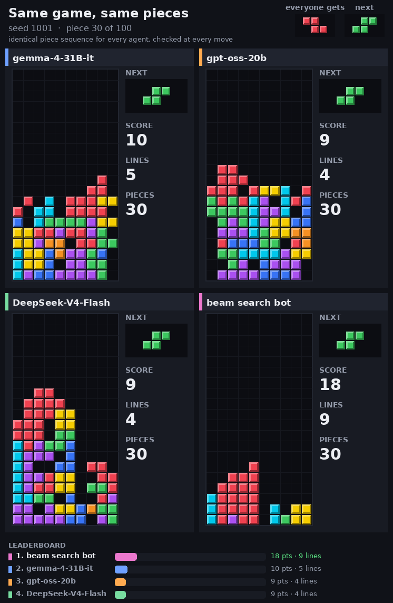

# Diffusion-Tetris  
**Code for**  
**_Diffusion-MPC in Discrete Domains: Feasibility Constraints, Horizon Effects, and Critic Alignment_**  
Case Study: Tetris  

📄 Paper: https://arxiv.org/abs/2603.02348  

---

## Overview

This repository provides a **complete implementation of diffusion-based planning in discrete domains**, using Tetris as a case study.

It includes:

- Offline **dataset generation** (teacher policy)
- **MaskGIT-style diffusion policy** training
- **Diffusion + MPC reranking** for decision-time planning
- Scalable **experiment pipeline** (Lightning-ready)

---

## Quick Start

Clone the repository:

```bash
git clone git@github.com:KevinChunye/Diffusion-Tetris.git
cd Diffusion-Tetris
```

Run the full pipeline:

```bash
# 1. Generate dataset
python -m experiments.pipeline dataset   --config configs/dataset_gen.yaml   --output_dir runs/dataset/ds_v1

# 2. Train diffusion model
python -m experiments.pipeline train   --config configs/diffusion_train.yaml   --output_dir runs/train/tr_v1

# 3. Evaluate with MPC reranking
python -m experiments.pipeline eval   --config configs/eval_run.yaml   --output_dir runs/eval/ev_v1
```

---

## Train, deploy and watch a bot

Every bot (random, greedy heuristic, beam search, CNN-DQN, diffusion-MPC, or an open LLM on
Tensormesh serverless) plays through one interface in `harness/`. **The same episode seed means the
same piece sequence for every bot**, so GIFs and metrics compare bots on identical games.

GIFs use the gym's colored renderer (`tetris_render.py`, opt in with `TetrisGym().enable_visual()` and
`env.render(info, mode="pretty")`). Each board has:
- standard tetromino colors;
- pieces that fall to a landing ghost;
- full rows that flash before they clear;
- a NEXT box and score/lines;
- a GAME OVER overlay.

Comparison GIFs keep every board on the same piece and verify, at every move, that all agents face
the same current and next piece. Use `--style classic` for the old matplotlib frames.



```bash
# four agents on one logged game (iteration 6, seed 1001): three LLMs replayed exactly + beam bot live
python -m harness.compare_gif --steps runs/explore/iter06/steps.csv --seed 1001 --pieces 100 \
    --arms gemma-4-31B/direct,gpt-oss-20b/low,DeepSeek-V4-Flash/direct --bots beam \
    --out runs/explore/iter06/four_agents_seed1001.gif
```

```bash
# train (CPU-friendly defaults, wraps the existing trainers)
python -m harness.train dqn --episodes 300 --max_steps 500 --runs_dir runs/train
python -m harness.train diffusion --episodes 100 --epochs 5 --out_dir runs/train/diffusion

# deploy: play seeded episodes, print score/lines/pieces, record a GIF of the first seed
python -m harness.play --bot beam --seeds 0,1,2 --pieces 100 --gif runs/play/beam.gif
python -m harness.play --bot dqn:runs/train/<run>/checkpoint.pt --seeds 0 --gif runs/play/dqn.gif
python -m harness.play --bot llm:openai/gpt-oss-20b --history stateless --seeds 1000 --pieces 50 --gif runs/play/oss20b.gif

# several bots side by side in one GIF (same pieces)
python -m harness.play --compare --bot greedy,beam,llm:openai/gpt-oss-20b --seeds 1000 --pieces 60 --gif runs/play/cmp.gif

# replay logged LLM pilots (llm/run_pilot.py) as side-by-side GIFs, one column per arm/model
python -m harness.replay --steps runs/explore/iter01/steps.csv --seed 1000
```

LLM bots need `TENSORMESH_API_KEY` in the environment; add `--mock` to run them offline.

## Serverless LLM exploration (Tensormesh, KV-cache reuse)

For the proposed open-weight Tetris benchmark, see the
[research protocol and experiment plan](notes/tetris_benchmark_protocol.md) and
[`configs/benchmark/pilot.yaml`](configs/benchmark/pilot.yaml). The protocol separates
gameplay quality, frozen-state prefix-cache replay, and serving-load/deadline experiments.
New runs distinguish model decisions from fallbacks and missing telemetry from reported zero hits.
Use `python -m llm.cache_replay --help` for paired cache probes and
`python -m llm.benchmark_report --help` for episode-level summaries. Offline `--mock` runs
validate the harness only; they are not real-model benchmark results.

`llm/` uses Tetris as a controllable long-horizon workload for serverless open-model inference, with
dense per-step regret as the quality signal. See `notes/tensormesh_probe.md` (platform probe),
`notes/exploration_log.md` (iterations), and `notes/exploration_summary.md` (findings).

**Long-context interference study (iteration 8).** Do a tenant's long-context requests delay its short
decision requests on a hosted endpoint, and does client-side admission help? See
[`notes/interference_study.md`](notes/interference_study.md) (results, with LIVE and SIMULATED evidence
kept separate) and [`notes/interference_novelty_matrix.md`](notes/interference_novelty_matrix.md)
(overlap audit and preregistration).

```bash
python -m llm.interference_pilot sim  --config configs/interference/pilot_v2.yaml --out <fresh dir>   # SIMULATED
python -m llm.interference_pilot live --config configs/interference/pilot_v2.yaml --out <fresh dir>   # LIVE, <= $1 est.
python -m llm.interference_analysis <run dir>                                                         # paired bootstrap
```

```bash
python -m llm.probe_tensormesh --out_dir runs/explore/probe              # Phase 0 probe
python -m llm.run_pilot --config configs/explore/iter01.yaml [--mock]   # one pilot (paired seeds)
python -m llm.analyze --dir runs/explore/iter01 --kind history          # table + figure
python -m pytest tests -q                                               # offline tests (no API calls)
```

## Pipeline

The framework is structured into three stages:

1. **Dataset Generation** — collect expert trajectories  
2. **Training** — learn diffusion-style policy (MaskGIT denoiser)  
3. **Evaluation** — MPC-style reranking with critic  

Key features:

- Resumable runs (`--resume`)  
- Structured outputs (`manifest.json`)  
- Unified artifact management  

---

## Scalable Experiments (Lightning)

To run large-scale jobs:

```bash
bash scripts/lightning_clone_ssh.sh
```

Submit batch experiments:

```bash
python -m experiments.submit_lightning_jobs   --plan_path runs/run_plans/<timestamp>_plan.yaml   --teamspace <teamspace>   --cluster <cluster>   --machine <machine>   --gpu <gpu>
```

---

## Project Structure

```
configs/        # Experiment configs
experiments/    # Pipeline + training/eval logic
scripts/        # Setup and automation
runs/           # Outputs (datasets, models, eval)
notes/          # Additional documentation
```

---

## Citation

If you find this work useful, please cite:

```bibtex
@article{wang2026diffusion_tetris,
  title={Diffusion-MPC in Discrete Domains: Feasibility Constraints, Horizon Effects, and Critic Alignment},
  author={Wang, Haochuan},
  year={2026},
  eprint={2603.02348},
  archivePrefix={arXiv}
}
```

---

## Notes

Additional details:  
`notes/lightning_runbook.md`
