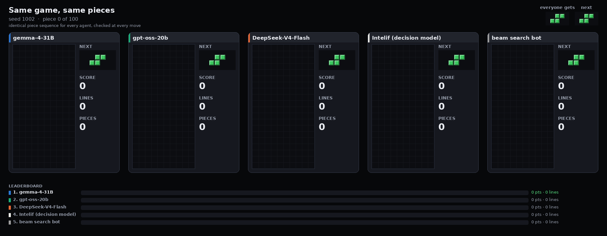
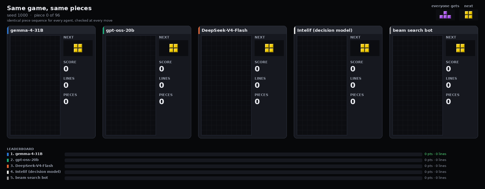
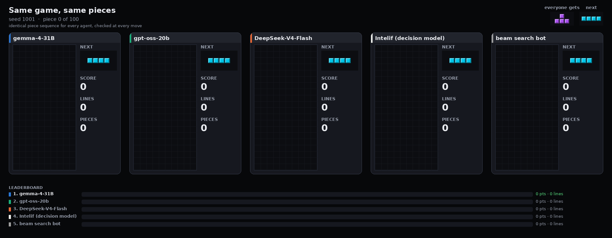
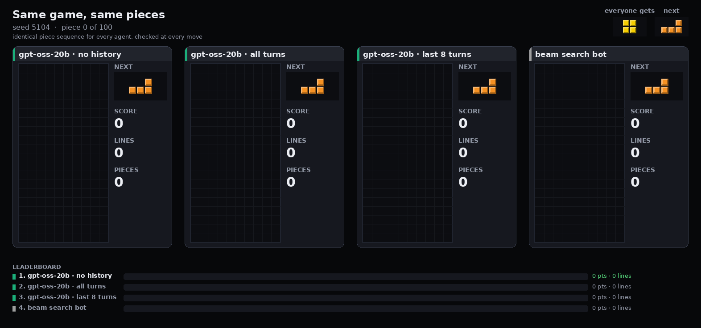
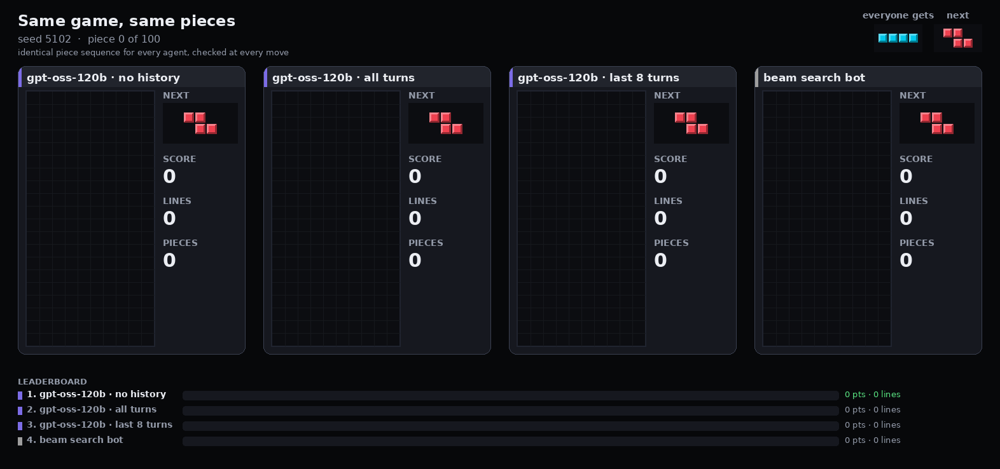
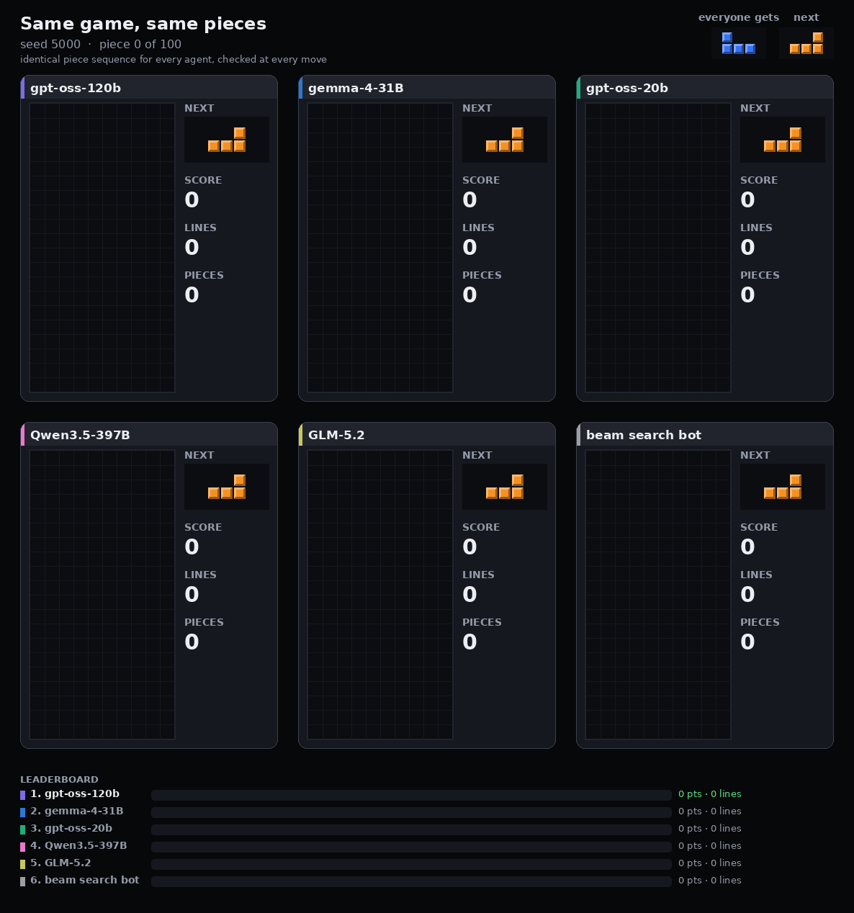

# Gallery: the agents of the paper, playing the same games

Every animation replays logged moves exactly, so what you see is what each agent did in the experiments.
All agents in a GIF receive the identical piece sequence (the piece order depends only on the seed, and
the renderer checks it at every move); the beam-search bot plays live on the same seed for reference.
Rebuild everything here with `python scripts/build_gallery.py`.

## 1. Language models and a decision model on the same game

Three open-weight language models served by Tensormesh (iteration-6 games, no history, legal-move
schema) and the Intelif decision model self-hosted on a 4-core CPU (Section 6.5 of the paper).

| Seed | gemma-4-31B | gpt-oss-20b | DeepSeek-V4-Flash | Intelif |
|:--|--:|--:|--:|--:|
| 1000 | 21 | 48 | 2 | 22 |
| 1001 | 124 | 34 | 9 | 28 |
| 1002 | 76 | 14 | 10 | 54 |

Final scores; the same ranking shows in the boards long before the end.

Seeds 1000 and 1001

## 2. The same model with more history plays worse

One model, three ways of carrying memory (Section 6.2): no history, every past turn resent, or the last
eight turns. The board is fully visible, so history adds no information; resending it makes play worse.

| Model, seed | no history | last 8 turns | all turns |
|:--|--:|--:|--:|
| gpt-oss-20b, 5104 | 58 (100 pieces) | 12 (50) | 2 (26) |
| gpt-oss-120b, 5102 | 62 (100 pieces) | 36 (85) | 14 (47) |

## 3. Price and size do not buy better play

Five of the nine model configurations of Section 6.1 on one of its seeds (5000, the seed whose ordering
best matches the ten-seed ranking): gpt-oss-120b (84 points) leads; GLM-5.2, the most expensive model,
tops out first (0 points after 30 pieces).

Snapshots used in the paper and READMEs are the `*_piece40.png` and `*_piece60.png` files next to each GIF.
