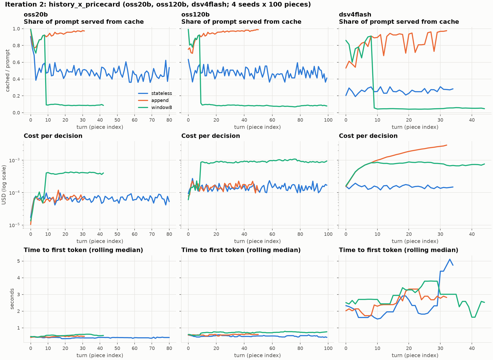

# Exploration summary: Tetris as a KV-cache workload for serverless open-model inference

> **Follow-up (iteration 8): long-context interference.** On two hosted endpoints, a tenant's own
> ~19k-token requests raised its ~1k-token decisions' p95 time-to-valid-action from 0.9 s to 15 s
> (gemma-4-31B-it). Starting longs only when no short is pending cut that by 69%, at equal cost;
> `priority` hints had no observable effect. See [`interference_study.md`](interference_study.md)
> (LIVE vs SIMULATED evidence kept separate; the quality guard is not yet established).

Branch `tensormesh_kv_explore`, 2026-10-02. Six iterations plus a Phase 0 probe, total API spend
**$5.18** of the $25 cap (`runs/explore/spend.csv`). Every number below links to a table and
figure under `runs/explore/`. The full reasoning trail is in `notes/exploration_log.md`, and the
platform probe is in `notes/tensormesh_probe.md`.

## The single most intuitive finding

**The same agent memory is the cheapest or the most expensive option, depending on one line of the
price card. The server caches the prefix either way.**



`runs/explore/iter02/figure.png`, middle row ("Cost per decision", log scale):
- On gpt-oss-20b and gpt-oss-120b (cached input billed $0), append-only history costs the same per
  decision as no history (0.0065 vs 0.0065 and 0.0153 vs 0.0144 $/100 decisions). That holds even
  though its prompt grows to 23–33k tokens, because 95–96% of it is served from the prefix cache.
  A sliding window of 8 turns costs **5–6× more**: dropping the oldest turn rewrites the prefix right
  after the 530-token system prompt, so ~5k tokens are re-prefilled and billed on every move.
- On DeepSeek-V4-Flash, which caches (84% of append's prompt is a *reported* cache hit) but lists no
  cached price, the ranking **flips**. Append becomes the most expensive policy: **10.4×**
  stateless, and 2.1× the window.
- Iteration 5 shows the same pattern for parallel calls. K simultaneous requests over a shared 14k
  prefix are prefilled once by the server, but DeepSeek bills them K times.

Agent memory design and serving economics cannot be separated: *how* a context is edited decides
what is re-prefilled, and the price card decides whether reuse is passed on to the user.

## What we learned

1. **Platform (Phase 0).**
   - All 9 catalog models stream, accept strict `json_schema`, and do prefix caching.
   - `usage.prompt_tokens_details.cached_tokens` is reported by 8/9. GLM-5.2 hides its hits: it
     always reports 0, yet a repeated 16k prefix drops TTFT from 10.5 s to 0.8 s.
   - Cold prefill of ~16k tokens ranges from 1.0 s (gpt-oss-20b) to 10.5 s (GLM-5.2). The network
     and proxy floor is ~0.15–0.5 s, so cache effects on TTFT only show above ~8–10k tokens on fast
     models.
2. **Memory policy vs cache (iterations 1–2, 3 models × 4 seeds).**
   - Costs are as above.
   - Quality is the surprise: on this Markov task, history **hurts**. Append raises per-decision
     beam regret by +3.5 on gpt-oss-20b and +2.6 on gpt-oss-120b (paired over 4 seeds, 4/4 same
     sign), and roughly halves survival. The damage is visible from the first 5 turns.
   - The cheapest memory to serve (append) is the most damaging. An 8-turn window is almost
     harmless for 120b but not for 20b.
3. **Cache capacity under concurrency (iterations 3–4).**
   - A prefix survives idleness as long as nothing evicts it. gpt-oss-20b/120b, Kimi, MiniMax and
     the Qwens keep a 15k-token agent context for ≥ 10 min at 12–16 concurrent contexts.
   - **DeepSeek-V4-Flash keeps about one.** Alone it hits after 30 s (3/3). With 4, 8 or 16
     concurrent contexts of ours it hits **0/28**, its prefills serialize (~3 s each), and at 16 it
     returns 429 "server overloaded".
   - Keep-alive pings cannot rescue that: 0/8 with pings vs 0/8 silent, because the pings queue
     behind the overload.
   - gemma-4 starts dropping at 12 contexts (1/3 hits at 10 min).
   - Iteration 3's apparent "< 30 s lifetime" was this capacity effect, caught by an isolated
     control.
4. **Fan-out (iteration 5).** The platform dedups in-flight identical prefixes, so there is no
   thundering herd. Cold fan-out of K = 4 or 8 is the fastest strategy: one prefill, makespan ≈
   one cold prefill. Priming first is unnecessary.
5. **Model ladder (iteration 6; stateless memory, constrained output, 9 arms × 3 seeds).** Price and
   size do not buy decisions.
   - The cost Pareto front is gpt-oss-20b ($0.0065/100 decisions) → **gemma-4-31B answering
     directly** ($0.010, lowest regret 0.38, 0.7 s) → gpt-oss-120b at medium reasoning ($0.091,
     best lines cleared 0.85, but 8.3 s median and 5% of moves running away to the 4096-token cap).
   - The most expensive model (GLM-5.2) and the two Qwens are among the weakest players, along with
     DeepSeek-V4-Flash.
   - A first attempt at concurrency 16 was rate-limited (HTTP 429 on ~7% of moves). Concurrency
     ≤ 6 avoided it.
6. **Environment (Phase 1).**
   - The real piece sequence used to depend on how much an agent simulated: beam and greedy saw
     different pieces from index 2 on the same seed. It is now a function of the episode seed only,
     with non-clairvoyant simulation clones. Tests: `tests/test_env_rng.py`.
   - The v1 diffusion config (mask+heuristic, K=64, H=8, 100 episodes; same freshly trained
     checkpoint; 50-piece cap on CPU), before vs after the fix: mean score **23.90 [21.92, 25.99] vs
     24.12 [22.32, 26.04]**. The bug did not bias v1-style means. It made them unreproducible: the
     eval runner never seeded the global stream, and simulations consumed it. It also made paired
     agent comparisons impossible. Details: `runs/explore/phase1_rng_fix/`.

Decision-quality yardstick (same oracle, seeds 1000–1002): beam search (H=3, W=16) has regret
0.12/decision and top-1 agreement 54%. Greedy has 0.21 and 46%. The best LLM configuration is
gemma-4-31B direct at 0.38/decision; the history arms of iterations 1–2 sit at 3–4.

## Watch the models play

Each logged episode replays exactly: the episode seed fixes the pieces, and `used_id` is the
executed move. Every GIF compares bots on the **same piece sequence**, using the repo's own renderer.

| iteration | what it shows | file |
|:--|:--|:--|
| 1 | gpt-oss-20b with stateless / append / window8 / compact16 memory (seed 1001) | `runs/explore/iter01/replay_seed1001.gif` + `_piece30.png` |
| 2 | gpt-oss-20b vs gpt-oss-120b vs DeepSeek-V4-Flash (stateless), plus 120b with append history | `runs/explore/iter02/replay_seed1000.gif` + `_piece40.png` |
| 6 | all 9 ladder arms in a 3×3 grid (seed 1001) | `runs/explore/iter06/replay_seed1001_grid.gif` + `_piece30.png` |

```bash
# any logged pilot, any seed, any subset of arms (grid or row)
python -m harness.replay --steps runs/explore/iter06/steps.csv --seed 1002 --ncols 3 --scale 0.38
# deploy bots live on the same seed, side by side (LLM bots call Tensormesh; --mock for offline)
python -m harness.play --compare --bot greedy,beam,llm:google/gemma-4-31B-it --seeds 1000 --pieces 80 --gif runs/play/cmp.gif
# train, then deploy
python -m harness.train dqn --episodes 300 && python -m harness.play --bot dqn:<checkpoint> --gif runs/play/dqn.gif
```

## Reproduce

```bash
python -m llm.probe_tensormesh                                   # Phase 0
python -m llm.run_pilot --config configs/explore/iter01.yaml     # iterations 1, 2, 6 (game pilots)
python -m llm.cache_lifetime --config configs/explore/iter03.yaml  # iterations 3-4 (lifetime/capacity)
python -m llm.fanout --config configs/explore/iter05.yaml        # iteration 5
python -m llm.analyze --dir runs/explore/iter02 --kind models    # history|models|lifetime|capacity|fanout|ladder
python -m llm.reference_regret                                   # regret yardstick (greedy, beam)
python -m pytest tests -q                                        # 13 offline tests, no API calls
```

## Ranked next steps

1. **Capacity table for the whole catalog.** N ∈ {1, 2, 3, 4, 8, 16, 32} concurrent contexts ×
   gaps {5, 30, 120 s} × 3 times of day. Use the tier split (vLLM vs LMCache) on gpt-oss-120b, Kimi
   and MiniMax to tell eviction from routing. That gives a per-deployment "how many agents stay warm"
   number. Cheapest and highest impact.
2. **Cache-friendly *and* decision-safe memory.** Append compact action/outcome summaries instead
   of full board renderings. This tests whether the regret damage comes from context length or from
   repeated stale boards. Target: append-level cost with stateless-level regret.
3. **Latency-coupled reward.** Add move deadlines (0.5–4 s) with fallback on a late reply. Under
   concurrency, DeepSeek's evictions should turn directly into worse play.
4. **Price-card waste accounting.** Compare computed vs billed prefill tokens per policy across a
   fleet (iterations 2 and 5 show 8–10× on DeepSeek), and propose a cached price.
5. **Reasoning budget per decode-second.** gpt-oss-120b medium vs low bought +0.28 normalized
   lines for 7.4× the latency. Sweep effort, and cap reasoning tokens, against regret per decode
   second; add a cap-and-fallback policy for runaway reasoning.

## Config to scale for a paper

- `configs/explore/iter02.yaml` (memory policy × price card), scaled to:
  - models: gpt-oss-20b, gpt-oss-120b, DeepSeek-V4-Flash, plus one more no-cached-price model
    (Qwen3.5)
  - arms: stateless / append / window8 / compact16
  - **10 paired seeds × 100 pieces**
  - constrained output (`json_schema`)
- Paired with the iteration-4 capacity sweep (`configs/explore/iter04_load*.yaml`) on the same
  models.

Projected cost: about $8 for the memory grid (DeepSeek append dominates) plus about $1 per capacity
sweep. Report:
- $/decision, cached share, prefills computed vs billed
- TTFT p50/p90, regret/decision, normalized score
- hit rate vs N

## Caveats

- Shared multi-tenant platform. Latency, 429s (iteration 6 attempt 1: 7% of moves) and cache
  capacity depend on other tenants and the time of day. Arms were always run concurrently, paired in
  time, to cancel this.
- TTFT is measured through an egress proxy (floor ~0.15–0.5 s). Prefill effects are read from
  non-streaming `max_tokens=1` latency and cached-token counts.
- 3–4 seeds per pilot. Effects are reported with per-seed sign agreement and paired t, not as final
  estimates.
- The regret oracle is approximate: greedy rollouts plus a narrow beam on sampled futures, with
  common random numbers. It ranks moves consistently but is not ground truth.
- The v1 before/after uses a freshly trained checkpoint (heuristic teacher; the paper's checkpoint
  is not in the repo) and 50-piece episodes on CPU.
